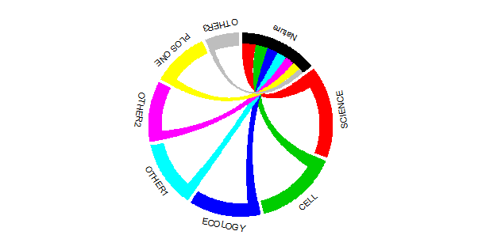
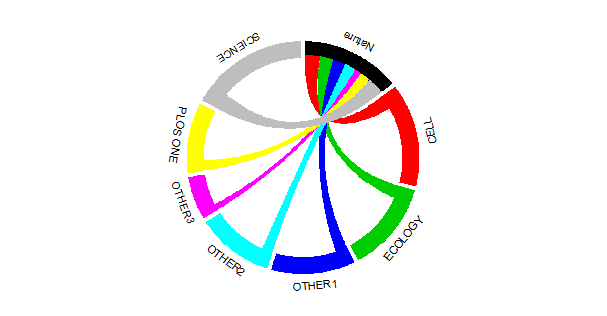

# circos.JCR

 

## Installation (1.0.1)

**version 1.0.1** from Github

	
	install.packages("devtools")
	library(devtools) 
	
	install_github("PhDMeiwp/circos.JCR@master", force = TRUE)
	library(circos.JCR)

# Examples
	library(circlize)
	library(circos.JCR)
	x = c(15, 11, 18, 16, 14, 13, 12, 7,)  # an example of citing data of journal "Nature"
	Name =c("Nature", "PLOS ONE", "SCIENCE", "CELL", "ECOLOGY", "OTHER1", "OTHER2", "OTHER3")
	
	circos.JCR(x = x, JCR.name = Name, start.degree = 90, order.by = 0, text.size = 0.7)
	
	circos.JCR(x = x, JCR.name = Name, start.degree = 90, order.by = 1, text.size = 0.7)
	

  
  
  
	
	
## Contributors
http://jokergoo.github.io/circlize/