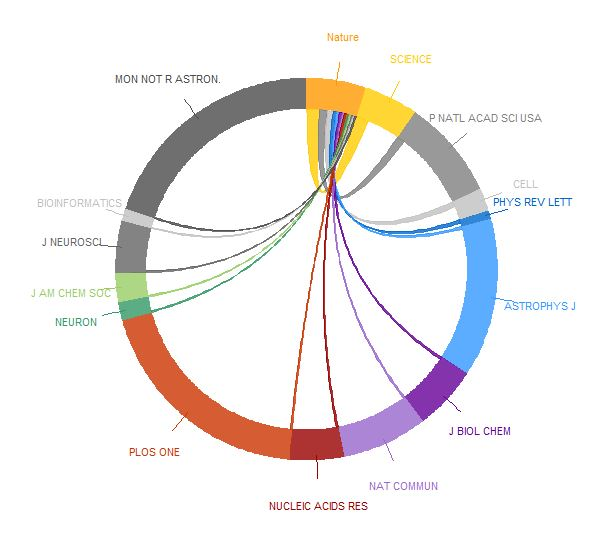
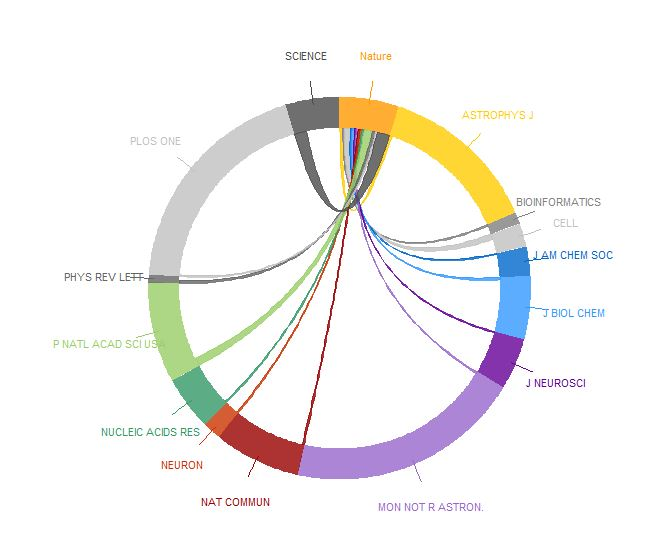

# circos.JCR

 

## Authors

Weiping MEI https://PhDMeiwp.github.io

Graduate School of Fisheries and Environmental Sciences, Nagasaki University

## Installation

Get the development version from github:
	
	install.packages("devtools")
	devtools::install_github("PhDMeiwp/circos.JCR@master", force = TRUE)

## Usage

	circos.JCR(x.cite, JCR.name, x.allcite,
           col = NULL, transparency = 0.8,
           order.by = 0, text.size = 0.7,
           self.include = FALSE, start.degree = 90,
           draw.line = FALSE,
           ...)
  
## Examples

	library(circlize)
	library(circos.JCR)
	
	NatureCiting = c(4665, 2719, 1757, 1279, 713, 630, 556, 445, 441, 413,
					402,  387,  367,  359,  351)
	JCR.name =c("Nature", "SCIENCE", "P NATL ACAD SCI USA", "CELL", "PHYS REV LETT",
				"ASTROPHYS J", "J BIOL CHEM", "NAT COMMUN", "NUCLEIC ACIDS RES", "PLOS ONE",
				"NEURON", "J AM CHEM SOC", "J NEUROSCI", "BIOINFORMATICS", "MON NOT R ASTRON.")
	Allciting = c(7156,  6564,  12214, 2818, 968,
				19399, 7772, 10489, 6570, 27664,
				2251,  3487, 6329,  1475, 28571)
	
	circos.JCR(x.cite = NatureCiting, JCR.name = JCR.name, x.allcite = Allciting, start.degree = 90, order.by = 0, text.size = 0.7)
	circos.JCR(x.cite = NatureCiting, JCR.name = JCR.name, x.allcite = Allciting, start.degree = 90, order.by = 1, text.size = 0.7)
	

  
  
  
	
	
## Contributors
http://jokergoo.github.io/circlize/